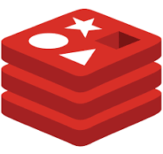
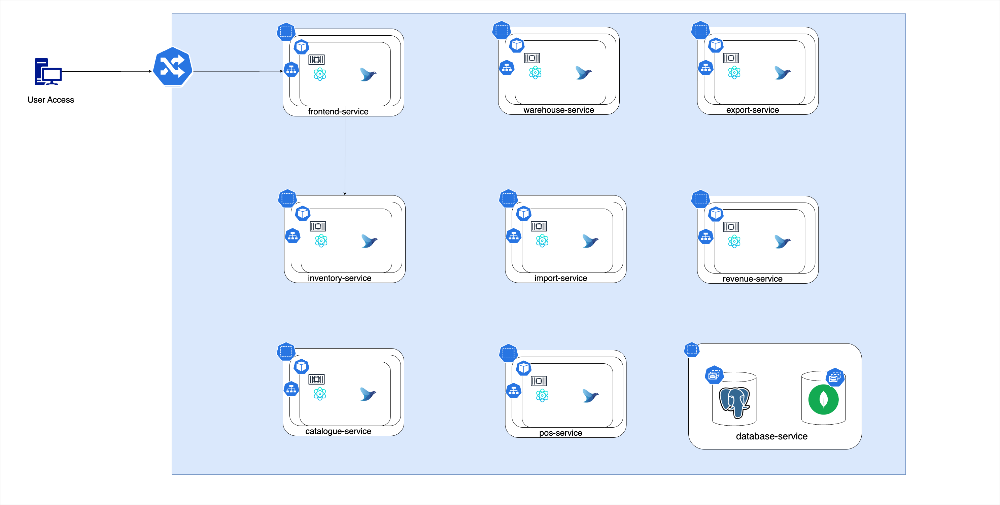
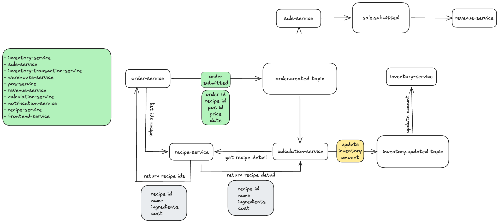

# Inventium - Inventory Management Application

Simplify the need for inventory and point of sales management. It helps businesses by providing the insights of revenue, sales, and inventory in one simple UI.

<h2>Frameworks and Technologies Used:</h2>

- Redis
- S3
- DynamoDB
- PostgreSQL
- Kafka
  

  
  
  
  
  

<h2>Promgramming Language:</h2>

- Go
- Typescript
- Java
  

  
  
  

<h2>Application Architecture Diagram</h2>

Inventium frontend microservices is powered by NextJS. Backend microservices are written in mostly Go and some written in Java. Some of them are in Go.

Redis was utilized for frontend static html elements.

DynamoDB was used for inventory-transaction-service to store inventory transaction records.

 

## Order Creation Flow

